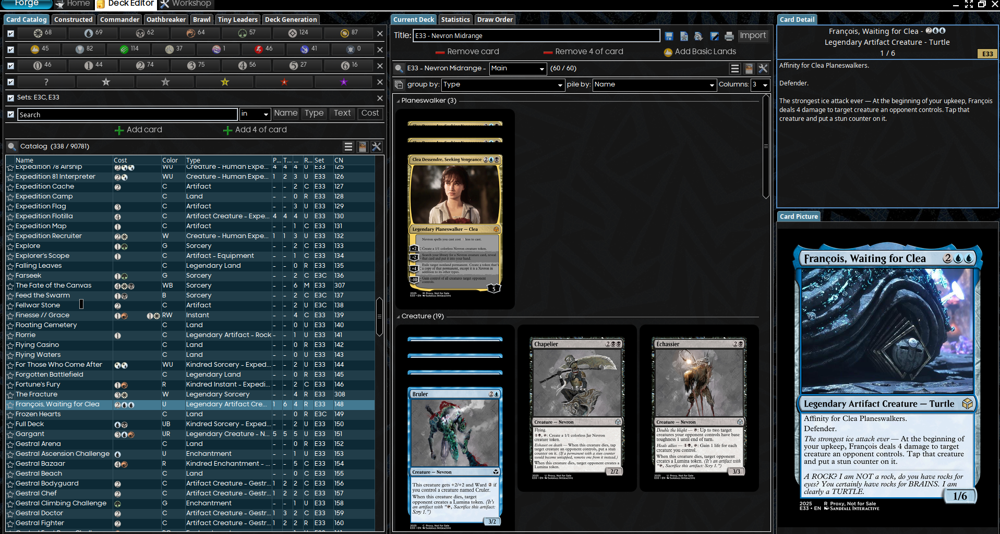
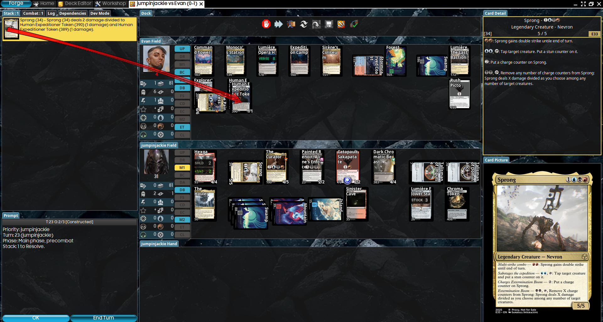

# forge-e33-mod

This a mod for [Forge](https://github.com/Card-Forge/forge) and a custom set for [Cockatrice](https://cockatrice.github.io/) based on the video game [Clair Obscur: Expedition 33](https://store.steampowered.com/app/1903340/Clair_Obscur_Expedition_33/).

This mod is multi-faceted and consists of:

 * [Current Focus] A new custom expansion set for Forge and Cockatrice with cards inspired by the lore, story, flavor, characters and mechanics from the video game.
 * A music mod for Forge to replace the built-in menu/battle music with a curated selection of tracks from the video game OST.
 * [Maybe in the future, if I'm still motivated] A custom [Forge quest mode](https://github.com/Card-Forge/forge?tab=readme-ov-file#-quest-modes) focused solely on the enemies and bosses of Expedition 33 with decks only from this custom set.
 * [In the long distant future maybe, if I'm really really motivated] A custom [Forge adventure mode](https://github.com/Card-Forge/forge?tab=readme-ov-file#-adventure-mode) plane focused solely on the world, enemies and bosses of Expedition 33 with decks only from this custom set.

# Installing (for Forge)

> Forge multiplayer is highly experimental and unstable. My attempts to get Forge multiplayer working have been absolute failures. Cockatrice is the recommended app if you want multiplayer magic with this set.

1. Install forge (latest stable or snapshot release)
2. Git clone this repo
3. Copy the `custom` folder into your Forge application data directory. Based on your OS, this will be:
   - Windows: `%APPDATA%\Forge` (or run the provied `build.bat` to automate this)
   - Linux: `~/.forge` (or run the provied `build.sh` to automate this)
   - OSX: TBD
4. Start Forge
5. In the Deck Editor, to see the cards in this set, change the set filter (the magnifying glass) to only include custom sets, or search for `Set:E33`

6. Start building decks with these new cards and have fun with some AI opponents!

# Installing (for Cocatrice)

TBD

# Set overview

> IMPORTANT: This set is in the process of development. It has not received any stringent playtesting, expect broken stuff, expect underpowered stuff, expect unintended interactions and everything in between!

To see what cards are in this set, check out the various design docs which detail every card and the design motivation behind them.

> SPOILER ALERT: Plot and character spoilers galore when discussing design motivations for most cards. If you don't want to be spoiled, perhaps play through and finish the video game first and come back later :-)

 * [Artifacts](/design/ARTIFACTS.md)
 * [Black](/design/BLACK.md)
 * [Blue](/design/BLUE.md)
 * [Colorless](/design/COLORLESS.md)
 * [Green](/design/GREEN.md)
 * [Lands](/design/LANDS.md)
 * [Multi-color](/design/MULTICOLOR.md)
 * [Red](/design/RED.md)
 * [White](/design/WHITE.md)
 * [Card Name List](/design/CARDLIST.md)
 * [Visual Spoiler](/design/SPOILER.md)

# Other design notes

 * [Set Mechanics](/design/MECHANICS.md)
 * [Deck Archetypes](/design/ARCHETYPES.md)

# Known issues

 * [Current List](/design/BUGS.md)