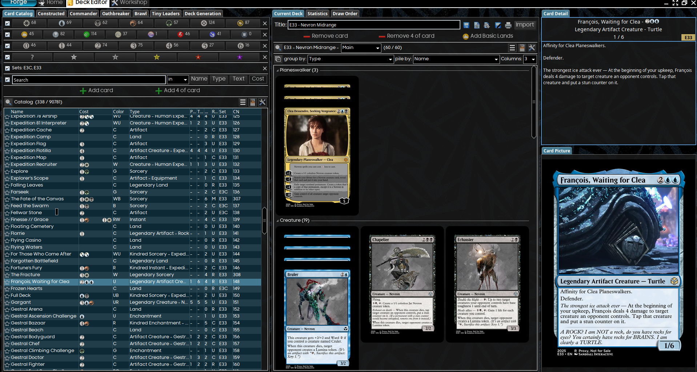
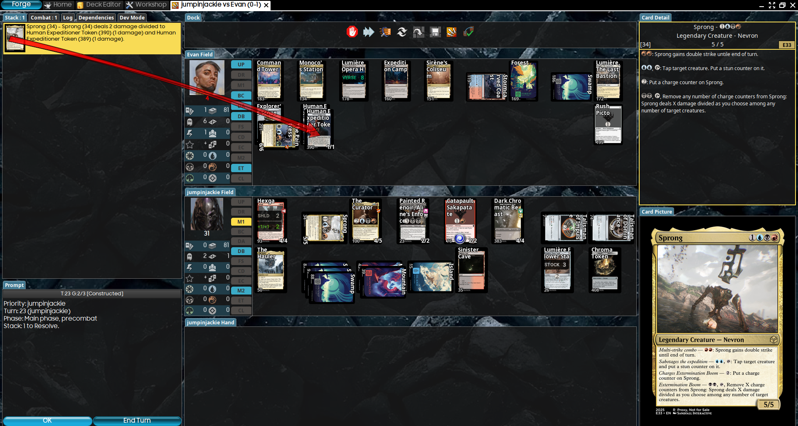

# forge-e33-mod

This a mod for [Forge](https://github.com/Card-Forge/forge) and a custom set for [Cockatrice](https://cockatrice.github.io/) based on the video game [Clair Obscur: Expedition 33](https://store.steampowered.com/app/1903340/Clair_Obscur_Expedition_33/).

This mod is multi-faceted and consists of:

 * [Current Focus] A new custom expansion set for Forge and Cockatrice with cards inspired by the lore, story, flavor, characters and mechanics from the video game.
 * A music mod for Forge to replace the built-in menu/battle music with a curated selection of tracks from the video game OST. Basically streamlining [these instructions](https://gist.github.com/jumpinjackie/a1e2ee5c7da29bf444b0e76870ad1f97)
 * [Maybe in the future, if I'm still motivated] A custom [Forge quest mode](https://github.com/Card-Forge/forge?tab=readme-ov-file#-quest-modes) focused solely on the enemies and bosses of Expedition 33 with decks only from this custom set.
 * [In the long distant future maybe, if I'm really really motivated] A custom [Forge adventure mode](https://github.com/Card-Forge/forge?tab=readme-ov-file#-adventure-mode) plane focused solely on the world, enemies and bosses of Expedition 33 with decks only from this custom set.

This is a fan project and is not affiliated with Sandfall Interactive or Wizards of the Coast.

# Installing (for Forge)

> Forge is only recommended for playing against AI opponents. My attempts to get Forge multiplayer working have been absolute failures. Circumstances may change in the future, but for now Cockatrice is the recommended app if you want multiplayer magic with this set.

## From source

> NOTE: You will need .NET SDK 10.0 or higher installed to run the `card_process.cs` file-based pre-processor tool.

1. Install forge (latest stable or snapshot release)
2. Git clone this repo
3. Run the `build.bat` (Windows) or `build.sh` (Linux) script to build and deploy the custom set assets into your Forge application data directory. Based on your OS, this will be:
   - Windows: `%APPDATA%\Forge`
   - Linux: `~/.forge`
   - OSX: TBD
4. (OPTIONAL) If you want to run custom cube drafts with this set, copy the following files
   - `custom/dist/forge/E33_Cube.dck` to `$YOUR_FORGE_INSTALL/res/cube/`
   - `custom/dist/forge/E33_Cube.draft` to `$YOUR_FORGE_INSTALL/res/draft/`
   - `custom/dist/forge/e33.rnk` to `$YOUR_FORGE_INSTALL/res/draft/rankings/`
5. Start Forge

## From release assets

1. For the relevant release, download the `forge_assets.zip` and `forge_pics.zip` files
2. Extract the contents of `forge_assets.zip` into your custom data directory. This is:
   - Windows: `%APPDATA%\Forge\custom`
   - Linux: `~/.forge/custom`
   - OSX: TBD
3. Extract the contents of `forge_pics.zip` into your custom images directory. This is:
   - Windows: `%LOCALAPPDATA%\Forge\Cache\pics`
   - Linux: `~/.cache/forge/pics`
   - OSX: TBD
4. (OPTIONAL) If you want to run custom cube drafts with this set, download:
   - `E33_Cube.dck` to `$YOUR_FORGE_INSTALL/res/cube/`
   - `E33_Cube.draft` to `$YOUR_FORGE_INSTALL/res/draft/`
   - `e33.rnk` to `$YOUR_FORGE_INSTALL/res/draft/rankings/`
5. Start Forge

## After installation

1. In the Deck Editor, to see the cards in this set, change the set filter (the magnifying glass) to only include custom sets, or search for `Set:E33` or `Set:E3C`

2. Start building decks with these new cards and have fun with some AI opponents!

If you want to run a custom cube draft with this set, assuming you installed the `E33_Cube.dck` and `E33_Cube.draft` files to the correct directories, follow [these instructions](docs/FORGE_CUBE.md)

# Installing (for Cockatrice)

## From source

> NOTE: You will need .NET SDK 10.0 or higher installed to run the `card_process.cs` file-based pre-processor tool.

1. Install Cockatrice
2. Git clone this repo
3. Run `build.sh`. The Cockatrice assets will be under `custom/dist/cockatrice`
4. In Cockatrice, select `Card Database - Add custom sets/cards` and select the `custom/dist/cockatrice/Expedition33.xml` file.

## From release assets

1. For the relevant release, download the `Expedition33.xml` file.
2. In Cockatrice, select `Card Database - Add custom sets/cards` and select the `Expedition33.xml` file you downloaded.

# Cube Drafting this set (with dr4ft)

> NOTE: There's an issue with dr4ft where it has incomplete support for importing custom DFC/Meld cards. As a result, you cannot see the other face of double-faced or meld cards in your current pack. You can see the faces of such cards just fine in Cockatrice, so I doubt it is something wrong with the XML file. As a workaround, refer to the [Visual Spoiler](design/SPOILER.md) whenever you see the front face of a DFC/meld card. Such cards have enough visual clues in their card frame

1. Visit [the website](https://dr4ft.info/) or your locally spun up instance.
2. Upload the `Expedition33_dr4ft.xml` file (DO NOT use `Expedition33.xml` as this contains commander cards and tokens and dr4ft doesn't like that. DO NOT use `Expedition33_dr4ft_fork.xml` as that contains DFC/Meld metadata that blows up importing into dr4ft.info. Only my fork of dr4ft can handle this particular file)
3. Create a new cube draft. Paste the contents of `dr4ft_cube.txt`
4. Share the draft room link with other players.
5. Start the draft once all players have connected.

# Cube Drafting this set (with my fork of dr4ft)

> NOTE: Use my fork of dr4ft if you wish to cube draft this set and be able to preview DFC/Meld cards. You will have to spin up your own separate instance of this fork.

1. Spin up [my fork of dr4ft](https://github.com/jumpinjackie/dr4ft)
2. Upload the `Expedition33_dr4ft_fork.xml` file (DO NOT use `Expedition33.xml` as this contains commander cards and tokens and dr4ft doesn't like that)
3. Create a new cube draft. Paste the contents of `dr4ft_cube.txt`
4. Share the draft room link with other players. If you spun this up on localhost, you will need to tunnel port 1337 so this dr4ft instance accessible to the outside world for other players to join in.
5. Start the draft once all players have connected.

# Set overview

To see what cards are in this set, check out the various design docs which detail every card and the design motivation behind them.

> SPOILER ALERT: Plot and character spoilers galore when discussing design motivations for most cards. If you don't want to be spoiled, perhaps play through and finish the video game first and come back later :-)

 * [Artifacts](/design/ARTIFACTS.md)
 * [Black](/design/BLACK.md)
 * [Blue](/design/BLUE.md)
 * [Colorless](/design/COLORLESS.md)
 * [Green](/design/GREEN.md)
 * [Lands](/design/LANDS.md)
 * [Multi-color](/design/MULTICOLOR.md)
 * [Red](/design/RED.md)
 * [White](/design/WHITE.md)
 * [Visual Spoiler](/design/SPOILER.md)
    * [Story Spoiler (the story of Expedition 33 as told by the cards in the set)](/design/STORY_SPOILER.md)

# Other design notes

 * [Design Goals](/design/GOALS.md)
 * [Set Mechanics](/design/MECHANICS.md)
 * [Deck Archetypes](/design/ARCHETYPES.md)

# Printing this set with MPC (MakePlayingCards)

 * [Instructions](/docs/MPC.md)

# Known issues

 * [Current List of Forge bugs](/design/BUGS.md)

# AI Content Disclosure

Artwork for most cards are (c) Sandfall Interactive (thanks for adding Photo Mode to make this job so easy!).

Where we have cards that have no in-game artistic depictions or the in-game depiction is sub-par, the artwork for such cards was generated with Google Gemini and Stable Diffusion, using character/fashion/scene references from the video game where possible.

All cards in this set properly credit/attribute the relevant artists so you know which ones use AI artwork and which ones don't, if it wasn't clear enough already.

No generative AI was used in actual card mechanics, designs and implementations.