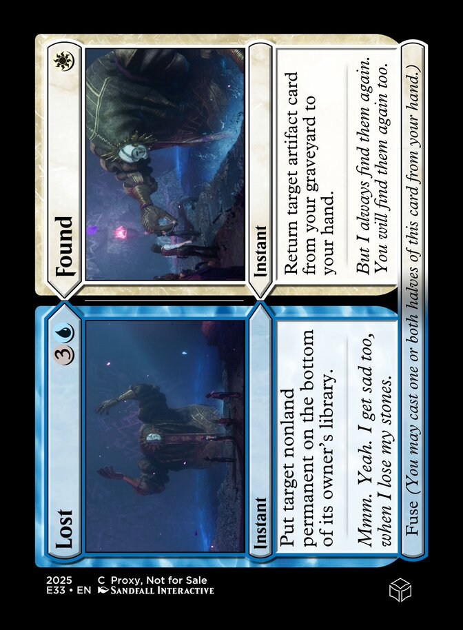
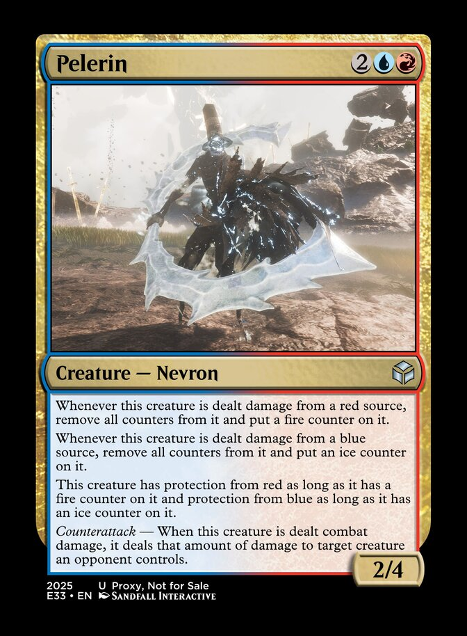
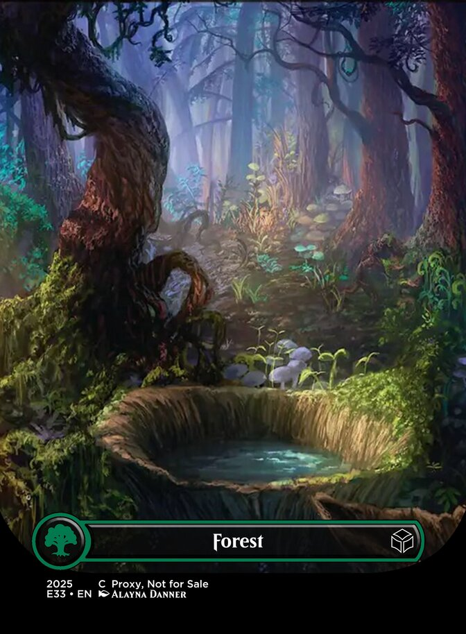
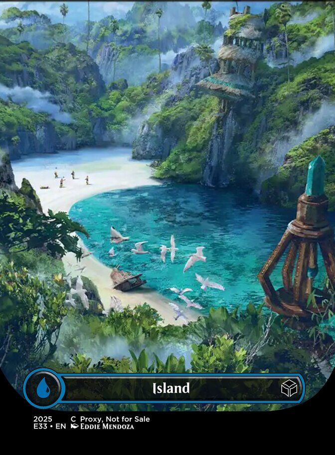
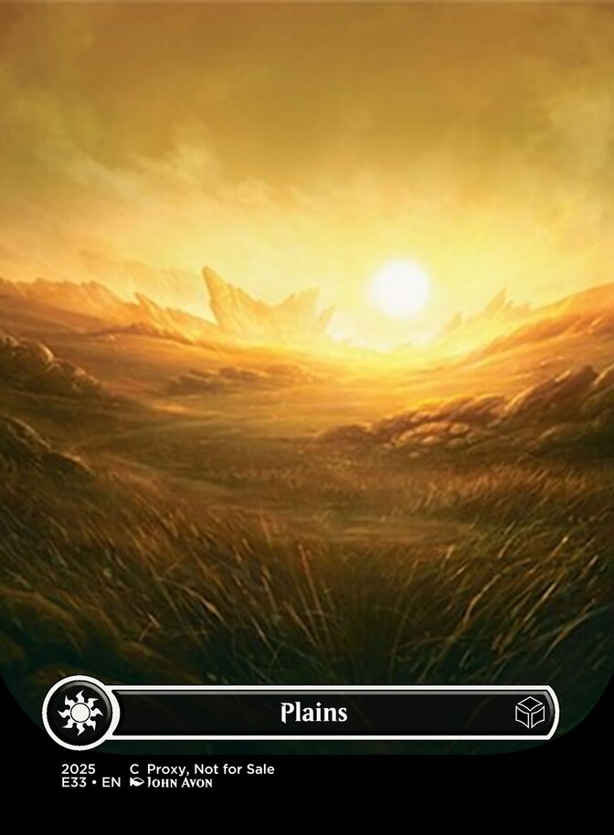
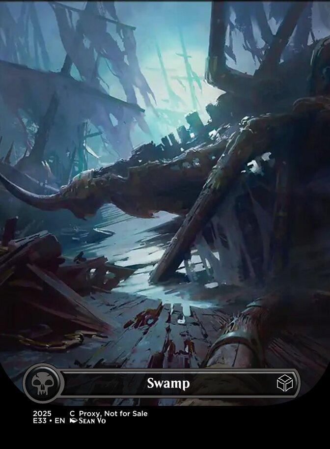

# Visual Spoiler

> This currently only shows cards/tokens we have full CardConjurer designs for and does not fully represent the whole set

# Clair Obscur: Expedition 33 (E33) [311/342 cards]
| | | |
|---|---|---|
|  |  |  |
| 
Jar
 | 
Pétank
 | 
Acceptance
 |
|  |  |  |
| 
Alicia's Birthday Party
 | 
All Set
 | 
Amandine, Fashion Stylist
 |
|  |  |  |
| 
Blanche, the Unfinished Creation
 | 
Bruler & Cruler, Nevron Blacksmiths
 | 
Chroma Barrier
 |
|  |  |  |
| 
Chroma Prison
 | 
Clair
 | 
Danseuse Teacher
 |
|  |  |  |
| 
Expedition 32 Trainees
 | 
Expedition Recruiter
 | 
Light the Path
 |
|  |  |  |
| 
Lumière Assault
 | 
Lumierian Apprentice
 | 
Payback
 |
|  |  |  |
| 
Perfect Dodge
 | 
Prismatic Strands
 | 
Repaint
 |
|  |  |  |
| 
Sciel's Intervention
 | 
Seal of Approval
 | 
Second Thoughts
 |
|  |  |  |
| 
The Fracture
 | 
An Advantage!
 | 
Antoine, Lumière Historian
 |
|  |  |  |
| 
Boucheclier
 | 
Bound by Chains
 | 
Breaking Moment
 |
|  |  |  |
| 
Bruler
 | 
Cache Discovery
 | 
Colette, Trinket Dealer
 |
|  |  |  |
| 
Crippling Tsunami
 | 
Cruler
 | 
Démineur
 |
|  |  |  |
| 
Denial
 | 
Dive Down
 | 
Eternal Ice
 |
|  |  |  |
| 
Expedition 43 Submersible
 | 
Expedition 78
 | 
François, Waiting for Clea
 |
|  |  |  |
| 
Gestral Ascension Challenge
 | 
Gradient Counter
 | 
Grandis Fashionist
 |
|  |  |  |
| 
Gustave's Insight
 | 
Hiding the Canvas
 | 
Ice Lance
 |
|  |  |  |
| 
Lune's Curiosity
 | 
Lune's Denial
 | 
Luster
 |
|  |  |  |
| 
Rip Apart Reality
 | 
Sky Break
 | 
Swift Counter
 |
|  |  |  |
| 
The Search for Esquie's Rocks
 | 
Thermal Transfer
 | 
Verisimilitude
 |
|  |  |  |
| 
Blot Out
 | 
Chalier
 | 
Chapelier
 |
|  |  |  |
| 
Clea's Chromatic Mastery
 | 
Depression
 | 
Dualliste's Lair
 |
|  |  |  |
| 
Échassier
 | 
Here's Your Card!
 | 
Maelle's Nightmare
 |
|  |  |  |
| 
Massacre at Dark Shores
 | 
Noir
 | 
Obscur
 |
|  |  |  |
| 
Painted Renoir, Aline's Enforcer
 | 
Piercing Strike
 | 
Ramasseur
 |
|  |  |  |
| 
Renoir's Creation
 | 
Renoir's Will
 | 
Surcease
 |
|  |  |  |
| 
The 67th Gommage
 | 
Twisted Lumière Citizen
 | 
Verso's Burden
 |
|  |  |  |
| 
Anger
 | 
Catapault Sakapatate
 | 
Chromatic Inversion
 |
|  |  |  |
| 
Crustal Crush
 | 
Demand Answers
 | 
Earth Rising
 |
|  |  |  |
| 
Entering the Canvas
 | 
Expedition 57 Siege Engine
 | 
Fortune's Fury
 |
|  |  |  |
| 
Gestral Bazaar
 | 
Gestral Fight Club
 | 
Gestral Volleyball Strike
 |
|  |  |  |
| 
Get Out Of My Way!
 | 
Grosse Tête
 | 
Hexga
 |
|  |  |  |
| 
Lightning Dance
 | 
Marked!
 | 
Orphelin
 |
|  |  |  |
| 
Persuasive Argument
 | 
Potier
 | 
Ranger Sakapatate
 |
|  |  |  |
| 
Robust Sakapatate
 | 
Rocher
 | 
Terraquake
 |
|  |  |  |
| 
Thunderfall
 | 
Ultimate Sakapatate
 | 
Abbest
 |
|  |  |  |
| 
All Suns' Dawn
 | 
Band Together
 | 
Bargaining
 |
|  |  |  |
| 
Expedition 35 Bridge
 | 
Expedition 69
 | 
Explore
 |
|  |  |  |
| 
Gault
 | 
Gestral Climbing Challenge
 | 
Lancelier
 |
|  |  |  |
| 
Nevron Disguise
 | 
Ophelie, Lumière Florist
 | 
Portier
 |
|  |  |  |
| 
Revitalization
 | 
Rock Throw
 | 
Shrine to The Paintress
 |
|  |  |  |
| 
Volester
 | 
A Storm is Coming
 | 
Aberration
 |
|  |  |  |
| 
Alicia Dessendre, Silenced by Fire
 | 
Ballet
 | 
Bénisseur
 |
|  |  |  |
| 
Bittersweet Reunion
 | 
Bourgeon
 | 
Braseleur
 |
|  |  |  |
| 
Breaking Rules
 | 
Chorale
 | 
Chroma is Flowing
 |
|  |  |  |
| 
Chromatic Petrification
 | 
Chromatic Rebirth
 | 
Chromatic Reclamation
 |
|  |  |  |
| 
Clair Obscur
 | 
Clea Dessendre, Seeking Vengeance
 | 
Closure
 |
|  |  |  |
| 
Contortionniste
 | 
Danseuse
 | 
Dualliste
 |
|  |  |  |
| 
Elemental Trick
 | 
Esquie, Friend of Verso
 | 
Esquie's Rescue
 |
|  |  |  |
| 
Estelle, Lumière Sculptor
 | 
Évêque
 | 
Expedition 41
 |
|  |  |  |
| 
Expedition 47 Drunkard
 | 
Expedition 59
 | 
Expedition 78 Airship
 |
|  |  |  |
| 
Finesse // Grace
 | 
Florian, Lumière Doomsayer
 | 
Full Deck
 |
|  |  |  |
| 
Gargant
 | 
Gestral Foot Race Challenge
 | 
Gestral Parkour Challenge
 |
|  |  |  |
| 
Gestral Raft Volleyball Challenge
 | 
Giant Sapling
 | 
Goblu
 |
|  |  |  |
| 
Gommage
 | 
Grandis Merchant
 | 
Greatsword Cultist
 |
|  |  |  |
| 
Gustave, Lumière Engineer
 | 
Lampmaster
 | 
Last Stand of Expedition 33
 |
|  |  |  |
| 
Leave this Canvas!
 | 
Lost // Found
 | 
Lune, Charting a Path
 |
|  |  |  |
| 
Maelle, Child of Lumière // Maelle, The Reawakened Paintress
 | 
Maelle, Child of Lumière // Maelle, The Reawakened Paintress
 | 
Manor Entrance // Manor Hidden Room
 |
|  |  |  |
| 
Manor Fire
 | 
Manor Greenhouse // Manor Gallery
 | 
Manor Kitchen // Manor Cellar
 |
|  |  |  |
| 
Manor Library // Manor Fireplace
 | 
Mask Keeper
 | 
Mime
 |
|  |  |  |
| 
Monoco, Collector of Feet
 | 
Nicolas, Seeking Inspiration
 | 
Painted Alicia, Eternally Suffering
 |
|  |  |  |
| 
Painted Clea, the Mistress
 | 
Painting Workshop
 | 
Pelerin
 |
|  |  |  |
| 
Rally the Expeditioners
 | 
Reaper Cultist
 | 
Sciel, Grieving for Many
 |
|  |  |  |
| 
Serpenphare
 | 
Simon, Consort of Clea // Simon, The Divergent Star
 | 
Simon, Consort of Clea // Simon, The Divergent Star
 |
|  |  |  |
| 
Sprong
 | 
Stalact
 | 
Stendhal
 |
|  |  |  |
| 
Terminate
 | 
The Curator // Renoir, Dessendre Patriarch
 | 
The Curator // Renoir, Dessendre Patriarch
 |
|  |  |  |
| 
The Fate of the Canvas
 | 
The Greatest Expedition in History
 | 
The Paintress // Aline Dessendre, Stricken by Grief
 |
|  |  |  |
| 
The Paintress // Aline Dessendre, Stricken by Grief
 | 
The Scavenger
 | 
Tomorrow Comes
 |
|  |  |  |
| 
Torture // Nurture
 | 
Troubador
 | 
Verso, Who Guards Truth With Lies
 |
|  |  |  |
| 
Vicarious Envy
 | 
Void Meteors
 | 
Whee // Whoo
 |
|  |  |  |
| 
When One Falls // We Continue
 | 
A Rock for François
 | 
Anti-Burn Picto
 |
|  |  |  |
| 
Anti-Freeze Picto
 | 
Attack Lifesteal Picto
 | 
Attack Picto
 |
|  |  |  |
| 
Barrier Breaker
 | 
Berrami, Collector of Journals
 | 
Bertrand Big Hands
 |
|  |  |  |
| 
Cheater Picto
 | 
Chroma Catalyst
 | 
Chroma Filter
 |
|  |  |  |
| 
Death Picto
 | 
Dessendre Family Portrait
 | 
Dominique Giant Feet
 |
|  |  |  |
| 
Dorrie
 | 
Energy Tint
 | 
Esquie's Magic Mushrooms
 |
|  |  |  |
| 
Expedition 50 Ferris Wheel
 | 
Expedition 64 Radio
 | 
Expedition Cache
 |
|  |  |  |
| 
Expedition Flag
 | 
Expedition Flotilla
 | 
Expedition Journal
 |
|  |  |  |
| 
Expedition Map
 | 
Expeditioner Uniform
 | 
Explorer's Scope
 |
|  |  |  |
| 
Florrie
 | 
Gestral Bodyguard
 | 
Gestral Doctor
 |
|  |  |  |
| 
Gestral Elder
 | 
Gestral Fighter
 | 
Gestral Lackey
 |
|  |  |  |
| 
Gestral Merchant
 | 
Gestral Pot
 | 
Gestral Ringleader
 |
|  |  |  |
| 
Gestral Villager
 | 
Gestral Warrior
 | 
Gestral Worker
 |
|  |  |  |
| 
Glass Cannon Picto
 | 
Golgra, Gestral Chef
 | 
Gustave's Journal
 |
|  |  |  |
| 
Healing Tint
 | 
Julien Tiny Head
 | 
Letter from Alicia
 |
|  |  |  |
| 
Limonsol, Matchmaker
 | 
Lorieniso, Gestral Musician
 | 
Lost Gestral
 |
|  |  |  |
| 
Lumière Flower Stand
 | 
Lumière Trashcan
 | 
Lumina Converter
 |
|  |  |  |
| 
Manor Door
 | 
Matthieu the Colossus
 | 
Noco, The Greatest Merchant
 |
|  |  |  |
| 
Ono-Puncho
 | 
Paint Cage
 | 
Paint Spike
 |
|  |  |  |
| 
Recoat
 | 
Revive Tint
 | 
Rush Picto
 |
|  |  |  |
| 
Sastro, Gestral Guardian
 | 
Shot Picto
 | 
Soarrie
 |
|  |  |  |
| 
Sunniso, Gestral Bouncer
 | 
Tall Gestral
 | 
The World Canvas
 |
|  |  |  |
| 
Urrie
 | 
Abbest Cave
 | 
Crushing Cavern
 |
|  |  |  |
| 
Dark Shores
 | 
Endless Tower
 | 
Esquie's Nest
 |
|  |  |  |
| 
Expedition Camp
 | 
Falling Leaves
 | 
Floating Cemetery
 |
|  |  |  |
| 
Flying Casino
 | 
Flying Waters
 | 
Forgotten Battlefield
 |
|  |  |  |
| 
Gestral Arena
 | 
Gestral Beach
 | 
Gestral Village
 |
|  |  |  |
| 
Lumière Aquafarm
 | 
Lumière Harbor
 | 
Lumière Opera House
 |
|  |  |  |
| 
Lumière, The Last Bastion
 | 
Manor Gardens
 | 
Monoco's Station
 |
|  |  |  |
| 
Painted Bluffs
 | 
Renoir's Drafts
 | 
Sirène's Coliseum
 |
|  |  |  |
| 
Spring Meadows
 | 
Stone Quarry
 | 
Stone Wave Cliffs
 |
|  |  |  |
| 
Sunless Cliffs
 | 
The Hauler
 | 
The Indigo Tree
 |
|  |  |  |
| 
The Monolith
 | 
The Monolith Interior
 | 
The Reacher
 |
|  |  |  |
| 
The Sacred River
 | 
Twilight Quarry
 | 
Visages // He Who Guards Truth With Lies
 |
|  |  |  |
| 
Visages // He Who Guards Truth With Lies
 | 
Yellow Harvest
 | 
Forest
 |
|  |  |  |
| 
Island
 | 
Mountain
 | 
Plains
 |
|  |   |   |
| 
Swamp
 |   |   |
## Tokens
| | | |
|---|---|---|
# Clair Obscur: Expedition 33 Commander (E3C) [51/51 cards]
| | | |
|---|---|---|
|  |  |  |
| 
A Life to Love
 | 
Austere Command
 | 
Path to Exile
 |
|  |  |  |
| 
Swords to Plowshares
 | 
Counterspell
 | 
Mana Drain
 |
|  |  |  |
| 
Damn
 | 
Feed the Swarm
 | 
Final Parting
 |
|  |  |  |
| 
Chaos Warp
 | 
Deflecting Swat
 | 
Cultivate
 |
|  |  |  |
| 
Doubling Season
 | 
Farseek
 | 
Abrupt Decay
 |
|  |  |  |
| 
Bedevil
 | 
Growth Spiral
 | 
Mortify
 |
|  |  |  |
| 
Primal Empathy
 | 
Putrefy
 | 
Void Rend
 |
|  |  |  |
| 
Arcane Signet
 | 
Chromatic Lantern
 | 
Commander's Sphere
 |
|  |  |  |
| 
Fellwar Stone
 | 
Mask of Memory
 | 
Mirage Mirror
 |
|  |  |  |
| 
Patchwork Banner
 | 
Sol Ring
 | 
Talisman of Conviction
 |
|  |  |  |
| 
Talisman of Creativity
 | 
Talisman of Curiosity
 | 
Talisman of Dominance
 |
|  |  |  |
| 
Talisman of Hierarchy
 | 
Talisman of Impulse
 | 
Talisman of Indulgence
 |
|  |  |  |
| 
Talisman of Progress
 | 
Talisman of Resilience
 | 
Talisman of Unity
 |
|  |  |  |
| 
Thought Vessel
 | 
Blade's Graveyard
 | 
Boat Graveyard
 |
|  |  |  |
| 
Command Tower
 | 
Crimson Forest
 | 
Dark Gestral Arena
 |
|  |  |  |
| 
Frozen Hearts
 | 
Lost Woods
 | 
Sinister Cave
 |
|  |  |  |
| 
Sky Island
 | 
The Meadows
 | 
White Sands
 |
