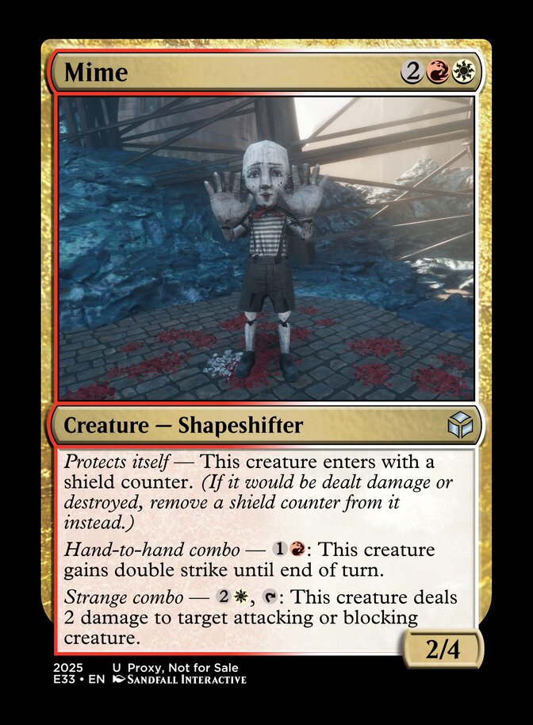
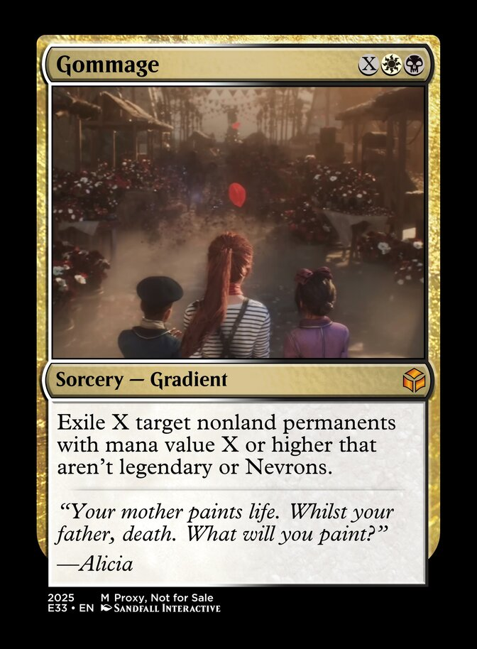
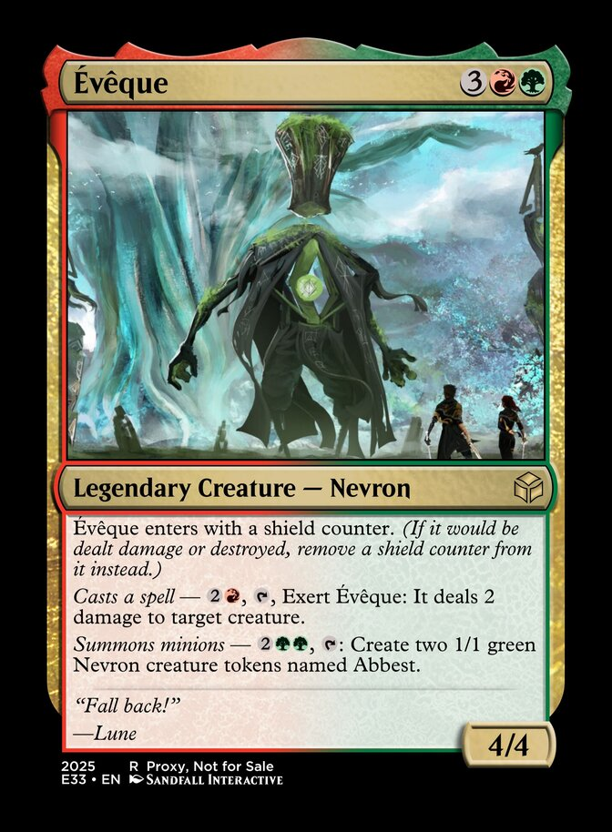
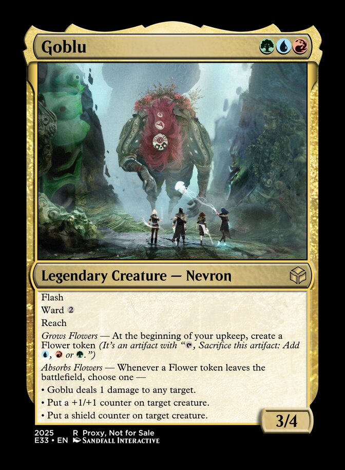
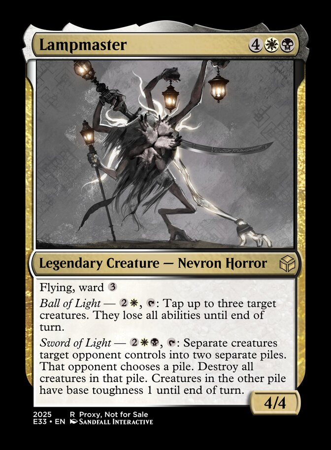
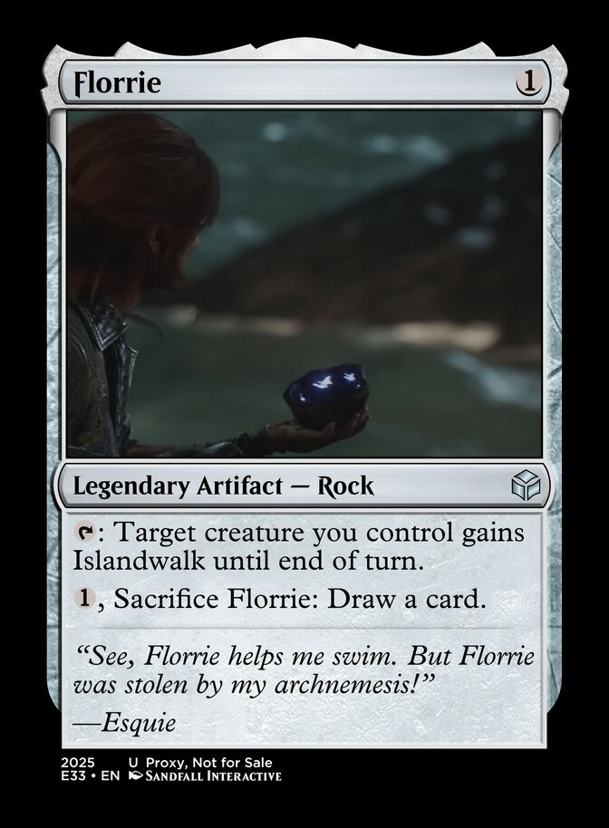
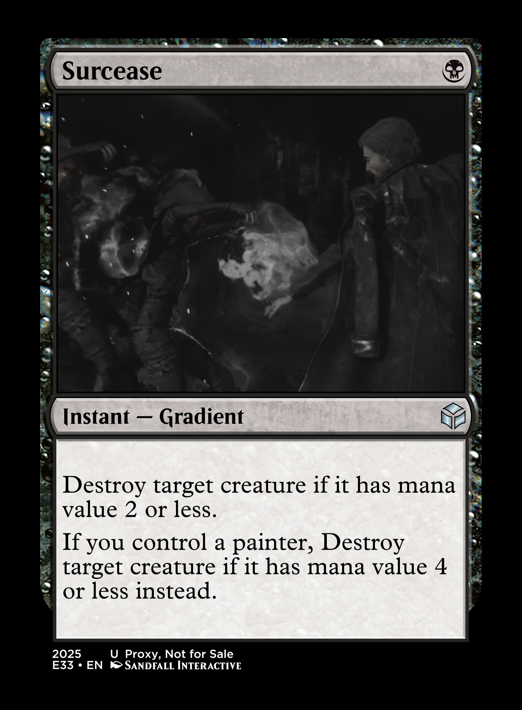
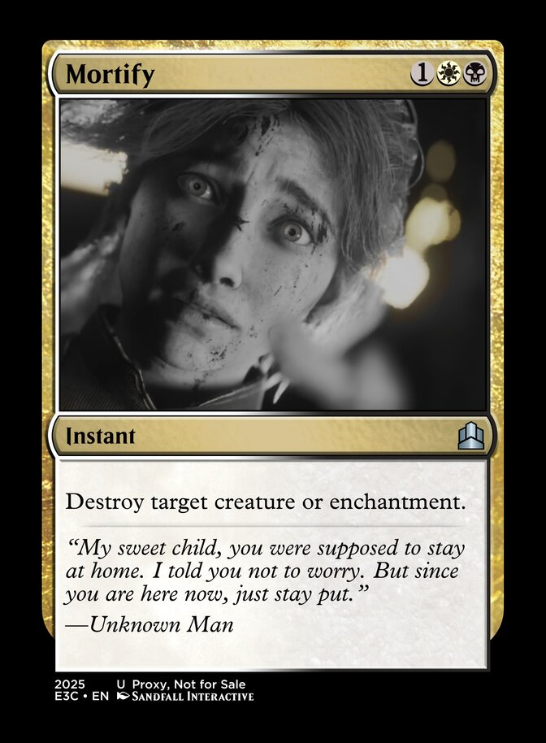
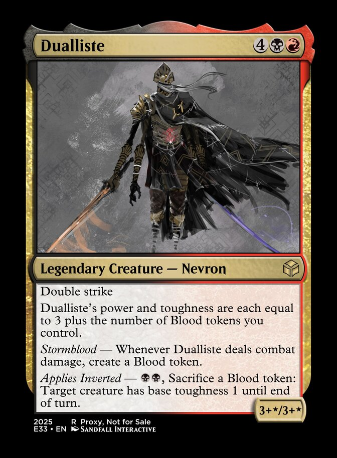
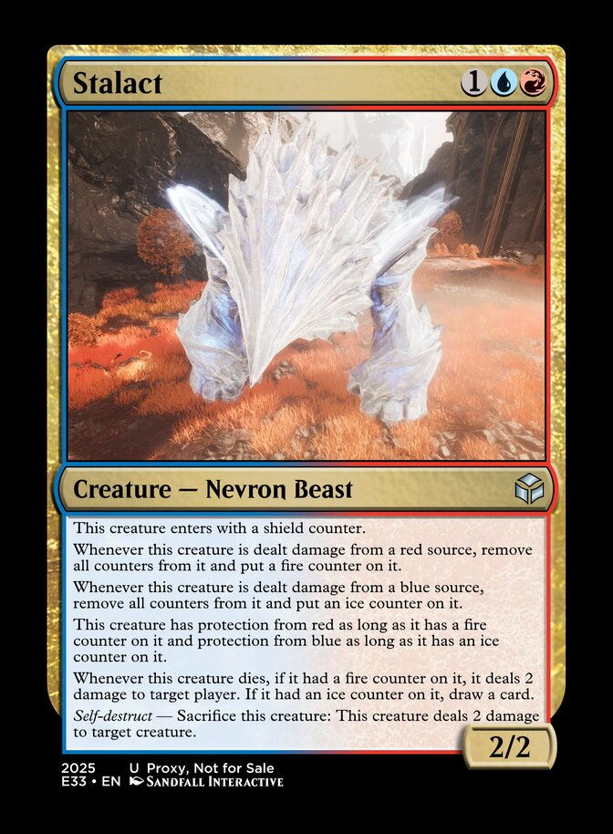

# Story Spoiler

> The story of Expedition 33 as told through the cards in this set. Inspired by the [Remember the Weatherlight series of articles on MTGSalvation](https://www.mtgsalvation.com/articles/49526-remember-the-weatherlight-part-1-come-sail-away)

## 1. Before the Prologue

| | | |
|---|---|---|
|  |  |  |
| 
In the "Real World", the Writers set fire to the Dessendre family Manor. Verso Dessendre dies in the fire, sending Aline Dessendre into a spiral of Grief.
 | 
Renoir and Aline's conflict resulted in The Fracture, a cataclysmic event that flung the city of Lumière into the ocean coincided with the appearance of The Monolith.
 | 
The city of Lumière sent out a search party to look for survivors.
 |
|  |  |  |
| 
A group of Expeditioners steal a bunch of Airships to take on the Paintress.
 | 
Expedition 70 marked the first expedition that made it to the Monolith interior. However they ran out of time and spent their final days, setting up grapple points in various places for those who come after.
 | 
Expedition 69 dedicated their mission towards mapping, surveying and installing grapple points throughout the continent.
 |
|  |  |  |
| 
Expedition 68 set sail for the Continent, but were struck by powerful storms.
 | 
Expedition 67 specialized in the use of explosives and made it all the way to Sirène's coliseum, but ran out of explosives and fell to Sirène's trance.
 | 
Expedition 64 used radios to keep in touch. The expedition started to collapse and eventually fail when their radio communications broke down.
 |
|  |  |  |
| 
Expedition 63 employed the use of automobiles to traverse the continent. This expedition failed when their vehicles crashed into a Nevron for driving too fast.
 | 
The legendary Expedition 60 made it all the way to the Monolith and confronted the Paintress through the sheer power of their mighty muscles. It is there they learned of the true threat which lied beneath the Monolith.
 | 
Expedition 60 sent a messenger back to Lumière to relay the news of the true threat, while the rest of the Expedition went to the bottom of the Monolith to face the true enemy.
 |
|  |  |  |
| 
While the rest of Expedition 60 went to the bottom of the Monolith to face the real enemy, William was assigned to send the message of the true enemy back to the citizens of Lumière. Unfortunately, he could not out-race the Gommage and could not make it back in time.
 | 
Someone in Expedition 59 suggested eating Nevrons for sustenance. Everybody proceeded to get food poisoning.
 | 
Expedition 49 employed strong defense/healing tactics, but soon learned real quick that defense is nothing without good offense.
 |
|  |  |  |
| 
Expedition 43 used submersibles to reach the Paintress. This ended in failure when they were all wiped out by the Serpenphare. 
 | 
Expedition 40 tried to enter the Monolith by flying/gliding through the barrier, but got gommaged crossing the barrier.
 | 
Expedition 35 perished to Nevrons in Falling Leaves. In their final moments, as they were becoming petrified, they threw themselves on top of each other to form a bridge for future expeditions to cross.
 |
|  |   |   |
| 
Expedition 34 was focused on an elemental strategy to exploit weaknesses in Nevrons. This strategy worked until they encountered Nevrons with no elemental weaknesses, at which point this expedition promptly failed.
 |   |   |

## 2. Prologue

| | | |
|---|---|---|
|  |  |  |
| 
The video game starts, enter the city of Lumière, the last bastion of human civilization.
 | 
We are introduced to Gustave.
 | 
Gustave has a penchant for throwing rocks.
 |
|  |  |  |
| 
Gustave is approached by Maelle, who tells him he should catch up with Sophie.
 | 
Gustave retorts to Maelle's remarks about the "usefulness" of throwing rocks at the Paintress.
 | 
On the eve of her Gommage, Gustave reunites with Sophie, his former girlfriend.
 |
|  |  |  |
| 
As Gustave walks Sophie through to the Harbor, they walk past a flower stand operated by Tiffanie.
 | 
On the way to the Harbor, Sophie meets Estelle who seeks advice on how to improve her sculpture of the legendary Esquie.
 | 
On the way to the Harbor, Gustave and Sophie walk past Alan and Catherine, who are trying to recruit volunteers for the next Expedition.
 |
|  |  |  |
| 
On the way to the Harbor, Gustave meets up with Ophelie. She asks him if he's interested in any more flowers.
 | 
On the way to the harbor, Gustave and Sophie walk past an innocuous trashcan. Nothing to see here. Move along.
 | 
On the way to the Harbor, Gustave meets Nicolas. He is seeking inspiration for a painting and wants you to dodge some of Sophie's attacks to inspire him.
 |
|  |  |  |
| 
With Gustave's swift dodges against Sophie's attacks, Nicolas gets the inspiration he needs for his painting.
 | 
Near the harbor, Gustave bumps into Florian who is babbling on about the end of days.
 | 
Near the Harbor, Sophie encounters a Mime. It attacks (and you are introduced to your first tutorial battle on breaking enemies)
 |
|  |  |  |
| 
Gustave and Sophie finally arrive at the Harbor.
 | 
At the Harbor, Gustave's apprentices meet up and tell him about an outfit Sophie made for him. Sophie cheekily rebukes the children for spoiling her surprise.
 | 
Sophie hands Gustave his Expedition uniform. She wants him to wear it before the Gommage begins.
 |
|  |  |  |
| 
The Paintress wakes up and initiates the Gommage.
 | 
Gustave arrives at the Expedition Festival to drown out his sorrows with alcohol and prepare for the upcoming expedition.
 | 
Emma arrives at the Festival, imploring her brother (Gustave) to stay in Lumière instead of going on this Expedition.
 |
|  |  |  |
| 
At the festival, Colette sells Gustave various artifacts and trinkets that may assist his Expedition.
 | 
At the festival, Amandine offers Gustave a haircut.
 | 
At the festival, Gustave meets Antoine, his professional rival for the last time.
 |
|  |  |  |
| 
With final preparations made, Expedition 33 departs Lumière for The Continent.
 | 
The Expedition flotilla makes landfall at the Dark Shores. The crew disembark.
 | 
There, a mysterious white-haired man appears and approaches the shocked Expedition party, surprised an old man who is not gommaged is in front of them.
 |
|  |   |   |
| 
Their surprise soon turned to horror as the white-haired man decapitates their leader (Alan) and Nevrons soon appears out of the woodwork and massacred most of the crew.
 |   |   |

## 3. Act I

| | | |
|---|---|---|
|  |  |  |
| 
Gustave, still alive, wakes up in Spring Meadows. He gathers his bearings and seeks to find any other surviving Expedition members.
 | 
Gustave eventually finds his fellow Expeditioners ... all dead. Feeling immense despair at his current predicament, he conjures up his pistol and considers the unthinkable, until he hears a familiar voice.
 | 
"You do that, we both die" Lune finds Gustave just in time and snaps him out of his depressive stupor.
 |
|  |  |  |
| 
After slaying their first Nevron, Gustave whips out his Lumina Converter to see if theory meets practice.
 | 
As they leave Spring Meadows, Gustave and Lune find another Expeditioner (Leo), but he is immediately impaled by the first major boss of this game.
 | 
Gustave and Lune finally arrive at their designated rallying point. There they find a clue as to where they need to go next.
 |
|  |  |  |
| 
On the way to Flying Waters, Lune suggests to set up camp. They have a quarrel over mission priority (Gustave wanting to find Maelle, Lune wanting to proceed with the original mission)
 | 
Gustave and Lune finally reach "the weird corals"
 | 
Gustave and Lune finally find the "door inside a hut". Upon approaching the door, they are immediately sucked in.
 |
|  |  |  |
| 
Gustave and Lune appear at the entrance of a Manor. They start exploring the place. They reunite with Maelle in one of the rooms.
 | 
After re-uniting with Maelle, a mysterious figure appears. Maelle explains how he has helped her while in the Manor.
 | 
Upon exiting the Manor, the party is confronted by Noco, one of the fabled Gestrals that Lune has been fascinated with, but never seen one in person, until now. Noco suggests to the party that they meet Golgra at the Gestral Village.
 |
|  |  |  |
| 
Near the Flying Waters exit, Gustave sees a flower which reminds him of Sophie. After he plucks the flower from its base, the party is ambushed by an enraged Goblu.
 | 
After leaving Flying Waters, the party set up camp. Maelle experiences nightmares.
 | 
After reaching the Ancient Sanctuary and making it through waves of Sakapatates, the party finally reach the Gestral Village.
 |
|  |  |  |
| 
Once in the village, the party meet Golgra, the "chef" of the village. The party enquires how to traverse the waters to reach the Paintress. Golgra suggests the party meet Esquie and tells the party you need a password to enter Esquie's Nest. But Golgra refuses to let weaklings visit Esquie, so she demands the party members fight in the Legendary Tournament to get the password.
 | 
The party meet Limonsol to set up some fights in the Legendary Tournament.
 | 
The party enter the Legendary Tournament. After defeating all the Gestral challengers, Limonsol sets up a match against a mysterious new warrior.
 |
|  |  |  |
| 
The "mysterious new warrior" turned out to be Sciel, who got separated from the party at Dark Shores and made it to the Gestral Village separately, seemingly content to live out her remaining life fighting Gestrals until the party reunited.
 | 
After acquiring the password from Golgra, the party heads to Esquie's Nest. There they meet Sunniso at the entrance, who asks for the password.
 | 
Under peer pressure, Gustave "volunteers" to shout the required password.
 |
|  |  |  |
| 
Sciel gives her glowing endorsement of Gustave "shouting the password as loud as you can" to get access to Esquie's Nest.
 | 
The party arrive at Esquie's Nest, but Esquie is nowhere to be found.
 | 
Esquie makes a spectacular entrance to greet the party. Esquie requires a rock named Florrie to swim. He requests the party get this rock from his archnemesis ... next door.
 |
|  |  |  |
| 
François, supremely annoyed at his lair being intruded by "hooligans", battles the party. Upon his defeat, he surrenders "Florrie" only for Esquie to discover it is fake and that the real Florrie is at the Stone Wave Cliffs. Esquie joins the party to go get Florrie.
 | 
At the party approaches the Stone Wave Cliffs, Maelle requests the party set up camp. At the camp, Gustave meets Sastro, who is looking for lost Gestrals.
 | 
At camp, while everybody is asleep, a sleeping Maelle is approached by the same white-haired man at Dark Shores and a Masked woman. The Masked woman begins an inner monologue about how she envies Maelle.
 |
|  |  |  |
| 
The party finally reach Stone Wave Cliffs.
 | 
Near the entrance of the Stone Wave Cliffs, the party discover the wreckage of a giant ferris wheel. Gustave explains the backstory of Expedition 50.
 | 
Esquie, floating nearby, senses that Florrie is close. Soon, a giant Bourgeon appears and the party is amazed at the ease at which Esquie takes down this Bourgeon.
 |
|  |  |  |
| 
As the party travel through the Stone Wave Cliffs, they discover a shrine to the Paintress.
 | 
As the party enter a cave tunnel, it starts to light up.
 | 
At the end of the lit path, they are confronted by the Lampmaster. The Act 1 final boss.
 |
|  |  |  |
| 
Upon the defeat of the Lampmaster, Sciel finds Florrie. Now with the ability to swim, the party start to embark on Esquie. Maelle and Gustave stay around for a little bit, to savor the possibility that their mission might succeed.
 | 
Maelle suggests Gustave throw another rock. While Gustave looks for a suitable rock, the sound of the white-haired man's walking stick echoes ominously. Just a Gustave finds a suitable rock, he is mortally wounded by the white-haired man.
 | 
Lune and Sciel, who are already on Esquie are wondering what is happening up above. Suddenly the defeated Lampmaster re-appears.
 |
|  |  |  |
| 
Gustave, sensing the odds slipping away, goes for a desperation overcharge attack against the white-haired man.
 | 
Gustave loses his mechanical arm with the overcharge attack. Seeing that his attack had no effect on the white-haired man, he is resigned to his fate, while Maelle trapped and powerless, looks on in horror.
 | 
After killing Gustave, the white-haired man confronts Maelle and banishes her out of this plane of existence.
 |
|  |  |  |
| 
Banished to an unknown void, Maelle witnesses a conversation between two voices. The male voice gives her comforting assurance and tells her to stay put and sends her back to The Continent.
 | 
Surprised that the banished Maelle has returned, the white-haired man prepares to land a killing blow, only for his strike to be parried away by a mysterious individual.
 | 
Back at camp. Esquie offers a distraught Maelle a soft embrace.
 |
|  |  |   |
| 
The mysterious individual who saved Maelle at the Stone Wave Cliffs, meets the remaining party and introduces himself and offering to join. He also reveals the identity of the white-haired man as Renoir. When asked how he has an Expeditioner uniform, the mysterious individual explains he was part of Expedition 00 and is immortal. He explains his motivations for wanting to join.
 | 
Maelle asks the mysterious individual what his name is. He replies: Verso.
 |   |

## 4. Act II

| | | |
|---|---|---|
|  |  |  |
| 
After introducing himself, Verso sees Maelle alone, still grieving over Gustave's death and hands her his journal.
 | 
With Esquie's new swimming abilities, the party reach the Forgotten Battlefield.
 | 
Traversing the Forgotten Battlefield, the party encounters the wreckage of many siege engines.
 |
|  |  |  |
| 
After clearing the Forgotten Battlefield, that party approach a bridge. At this point Maelle is overwhelmed by the amount of death she has witnessed. While the rest of the party try to console her, they are ambushed by the Dualliste, collapsing the bridge they're stading on as a result. The party falls down to the pit below, a pit of blood and literal death.
 | 
The party defeat the Dualliste and successfully escape the death pit.
 | 
After escaping the death pit, the party arrive at a suitable location to bury Gustave's remains. The party members say their last goodbyes before moving on.
 |
|  |  |  |
| 
Shortly after at camp, Lune prepares contingency plans in the event the Expedition fails.
 | 
The party finally reach Monoco's Station. but Monoco is nowhere to be found. Verso senses an ambush.
 | 
From out of nowhere, Monoco pounces but Verso senses him and swiftly parries his incoming strike. Verso remarks that Monoco is "slow as ever". Monoco praises Verso's still-sharp reflexes.
 |
|  |  |   |
| 
Monoco challenges the party to defeat the Stalact that just appeared. This battle introduces Gradient Attacks. After the battle Monoco demonstrates his unique gift: The ability to transform into other Nevrons by collecting their feet.
 | 
Monoco asked where the party was heading to. Verso replied "Old Lumiere" and Monoco immediately noped out after hearing that. Verso reminds him that there will be a lot of fighting, and with that one statement Monoco joins the party.
 |   |

