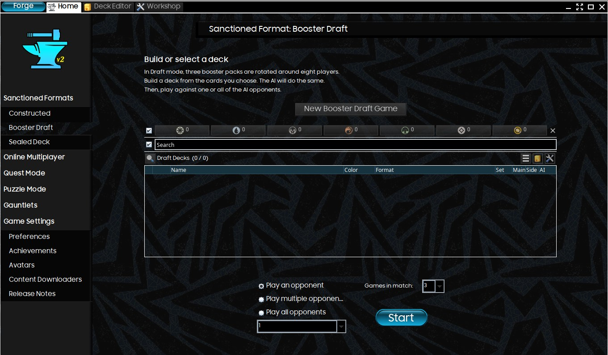
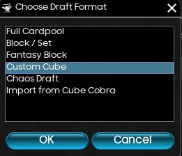
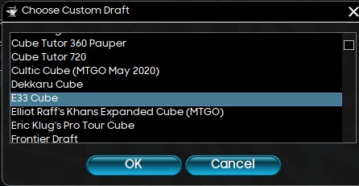
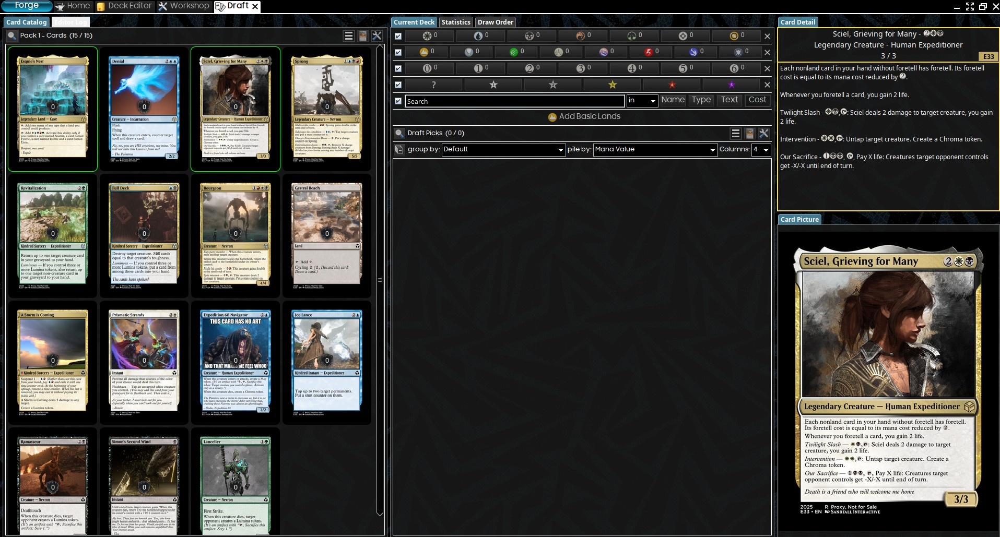
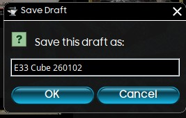
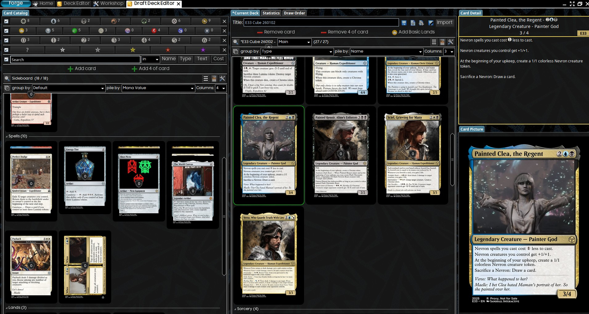
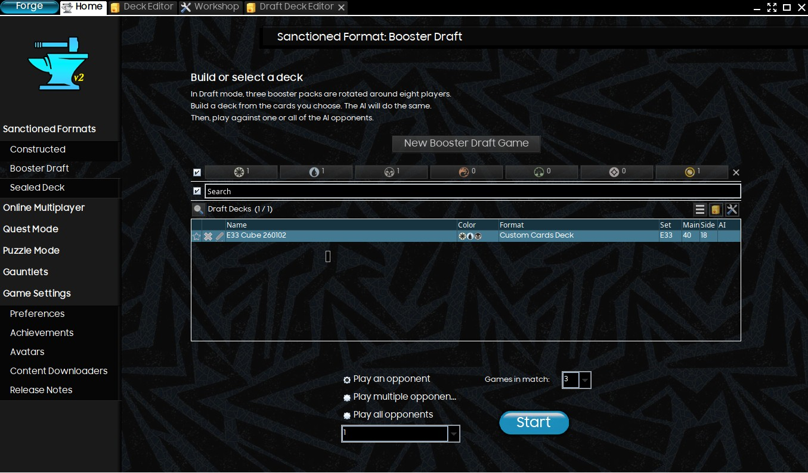

# Running Custom Cube Drafts in Forge

Once you have started Forge, click `Sanctioned Formats > Booster Draft`

Then click `New Booster Draft Game` and choose `Custom Cube`

If everything is installed properly, the `E33 Cube` should be available in the `Choose Custom Draft` dialog. Select it and click `OK`

The cube draft will now begin, you will be drafting your deck from three 15-card booster packs.

Once you have fully drafted your 3 booster packs, you will be prompted to save this draft.

You will then be taken to the deck editor where you then assemble your 40 card deck from your draft selections.

Once you have assembled your 40 card deck, save it and return to the original screen.

Your saved draft deck should now be visible, select it and choose your opponent parameters and click `Start` to start playing your draft deck against AI opponents from the same draft.